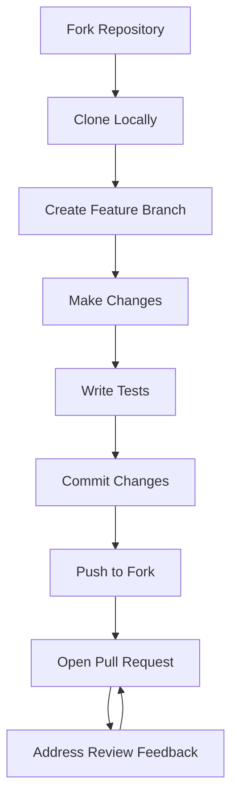

# 🧠 Brian - Your Personal Knowledge Base

[](https://opensource.org/licenses/MIT)
[](https://www.python.org/downloads/)
[](https://nodejs.org/)
[](https://pnpm.io/)


> *A play on "brain" - Brian is your intelligent knowledge repository with vector-based similarity search, beautiful graph visualization, and seamless Goose integration. Because I cannot spell 9/10 times and I make this mistake all the time, now you can too!*

---

## 📌 Table of Contents

- [🌟 Features](#-features)
- [🏗️ Architecture Overview](#-architecture-overview)
- [🚀 Quick Start](#-quick-start)
- [📖 Usage](#-usage)
- [🔧 Configuration](#-configuration)
- [🛠️ Development](#-development)
- [🔌 Goose MCP Tools](#-goose-mcp-tools)
- [📊 Similarity Algorithm](#-similarity-algorithm)
- [📈 Comparison with Alternatives](#-comparison-with-alternatives)
- [🐛 Troubleshooting](#-troubleshooting)
- [🤝 Contributing](#-contributing)
- [📝 License](#-license)
- [🙏 Acknowledgments](#-acknowledgments)
- [📚 Documentation](#-documentation)
- [🗺️ Roadmap](#-roadmap)

---

## ✨ Features

### Core Knowledge Management
- **📚 Knowledge Items**: Store links, notes, code snippets, and papers
- **🔍 Smart Search**: Full-text search with FTS5 + TF-IDF vector similarity
- **🏷️ Tagging System**: Organize items with tags for easy filtering
- **🔗 Link Previews**: Automatic metadata extraction from URLs
- **📄 Google Docs Support**: Seamless integration with Google Drive documents


### Multi-Project Knowledge Bases
- **🗂️ Multiple Projects**: Organize knowledge into separate project spaces


### Graph Visualization
- **🕸️ Force-Directed Graph**: Interactive D3.js visualization showing connections
- **🎨 Theme Highlighting**: Hover over tags to see themed connections with colored drop shadows
- **🔍 Semantic Zoom**: Smooth transitions between project, region, and item views
- **🌌 Knowledge Universe**: Zoom out to see all projects as "galaxies" in a unified space
- **📍 Knowledge Regions**: Group related items with visual boundaries


### Hierarchical Zoom (Knowledge Universe)
- **🔭 Multi-Scale View**: Seamlessly zoom from individual items to entire knowledge universe
- **🪐 Project Hulls**: Visual boundaries around project clusters when zoomed out
- **✨ Semantic Rendering**: Labels, nodes, and links adapt based on zoom level
- **📊 Zoom Indicator**: Real-time display of zoom level and current semantic view

### AI Integration
- **🤖 Goose Integration**: Use Brian directly from Goose AI assistant via MCP
- **🧭 Region Profiles**: Configure AI behavior per knowledge region
- **💡 Smart Context**: Get relevant knowledge context for any topic


---

## 🏗️ Architecture Overview

Brian is built with a **modular architecture** separating backend, frontend, and AI integration layers:

```
brian/
├── brian/                          # Backend (Python + FastAPI)
│   ├── api/                        # REST API routes
│   │   ├── items.py                # Knowledge item endpoints
│   │   ├── projects.py             # Project management endpoints
│   │   ├── regions.py              # Region management endpoints
│   │   ├── connections.py          # Explicit connection endpoints
│   │   └── search.py               # Search and similarity endpoints
│   ├── database/                   # SQLite database layer
│   │   ├── migrations.py           # Database migrations
│   │   ├── repository.py           # Data access layer (CRUD operations)
│   │   └── schema.py               # Database schema (SQLAlchemy models)
│   ├── models/                     # Business models
│   │   ├── knowledge_item.py       # Knowledge item model
│   │   ├── project.py              # Project model
│   │   ├── region.py               # Region model
│   │   └── connection.py           # Connection model
│   └── services/                   # Business logic
│       ├── similarity.py           # TF-IDF + cosine similarity
│       ├── clustering.py           # Item clustering for graph layout
│       └── embedding.py            # Vector embedding utilities
│
├── brian_mcp/                      # MCP Server (Goose Integration)
│   ├── server.py                   # MCP server implementation
│   └── tools/                      # MCP tool definitions
│
├── frontend/                       # Frontend (React + Vite + D3.js)
│   ├── public/                     # Static assets
│   └── src/
│       ├── components/             # React components
│       │   ├── SimilarityGraph.jsx     # Main graph visualization (D3.js)
│       │   ├── ProjectSelector.jsx     # Project management UI
│       │   ├── ProjectPill.jsx         # Project indicator
│       │   ├── Timeline.jsx            # Chronological view
│       │   ├── InfinitePinboard.jsx    # Spatial canvas
│       │   ├── RegionEditDialog.jsx    # Region management
│       │   ├── Settings.jsx            # App settings
│       │   └── ...
│       ├── contexts/               # React contexts
│       │   └── SettingsContext.jsx    # Global settings
│       ├── store/                  # State management (Zustand)
│       │   └── useStore.js             # Centralized state
│       ├── lib/                    # Utilities
│       │   ├── api.js                 # API client
│       │   ├── constants.js           # App constants
│       │   └── utils.js               # Helper functions
│       ├── App.jsx                  # Main app component
│       └── main.jsx                 # Entry point
│
├── scripts/                        # Helper scripts
│   ├── setup.sh                    # One-command installation
│   ├── start.sh                    # Start backend + frontend
│   └── stop.sh                     # Stop all servers
│
├── pyproject.toml                  # Python project config
├── requirements.txt                # Python dependencies
├── package.json                    # Frontend dependencies (in frontend/)
└── README.md                       # This file
```

### Data Flow
```
User Interaction (Web UI / Goose)
       ↓
   Frontend (React) → API Requests → Backend (FastAPI)
       ↓
   Database (SQLite) ←→ Similarity Engine (TF-IDF)
       ↓
   Graph Layout (D3.js Force-Directed)
       ↓
   Visual Rendering (Canvas / SVG)
```

### Key Technologies
| Layer | Technology | Purpose |
|-------|------------|---------|
| Backend | FastAPI | REST API server |
| Database | SQLite + SQLAlchemy | Data persistence |
| Frontend | React + Vite | UI framework |
| Graph Visualization | D3.js | Interactive graph rendering |
| State Management | Zustand | Client-side state |
| AI Integration | MCP (Model Context Protocol) | Goose AI assistant integration |
| Styling | Tailwind CSS + shadcn/ui | UI components |
| Icons | Lucide | Icon library |
| Animations | Framer Motion | Smooth transitions |

---

## 🚀 Quick Start

### Prerequisites

- **Python 3.8+** - [Download](https://www.python.org/downloads/)
- **Node.js 16+** - [Download](https://nodejs.org/)
- **pnpm** - [Install](https://pnpm.io/installation) (`npm install -g pnpm`)
- **Goose** (optional) - For AI assistant integration - [https://github.com/block/goose](https://github.com/block/goose)

### One-Command Installation

```bash
# Clone the repository
git clone https://github.com/spencrmartin/brian.git
cd brian

# Run the setup script
chmod +x setup.sh
./setup.sh
```

That's it! The setup script will:
- ✅ Install all Python dependencies in a virtual environment
- ✅ Install all frontend dependencies
- ✅ Create the Brian data directory at `~/.brian/`
- ✅ Configure the Goose extension (if Goose is installed)
- ✅ Create convenient `start.sh` and `stop.sh` scripts

### Start Brian

```bash
./start.sh
```

This starts both servers:
- **Backend**: http://localhost:8080
- **Frontend**: http://localhost:5173

### Stop Brian

```bash
./stop.sh
```

---

## 📖 Usage

### Adding Knowledge Items

**Via Web UI:**
1. Open [http://localhost:5173](http://localhost:5173)
2. Click the "+" button
3. Choose item type: **Link**, **Note**, **Snippet**, or **Paper**
4. Fill in the details (title, content, URL, tags)
5. Save!

**Via Goose:**
```
You: Add this link to Brian: https://example.com with tags "ai, research"
Goose: ✓ Added to your knowledge base!
```

### Managing Projects

**Creating a Project:**
1. Click the **Project Selector** at the top center
2. Click **"New Project"**
3. Enter name, description, choose an icon and color
4. Click **Create**

**Switching Projects:**
- Click the Project Selector and choose a project
- Select **"All Projects"** to view everything across all knowledge bases

**Editing Projects:**
- Hover over a project in the selector and click the edit (pencil) icon
- Change the name, description, icon, or color

### Graph Visualization

The graph view shows connections between items based on **content similarity**:

- **Node Colors**:
  - 🔵 Blue = Links
  - 🟢 Green = Notes
  - 🟡 Amber = Snippets
  - 🟣 Purple = Papers
- **Line Thickness**: Indicates similarity strength (thicker = more similar)
- **Theme Highlighting**: Hover over tags to see themed connections with colored drop shadows
- **Node Details**: Click any node to see full details in a bottom sheet
- **Zoom & Pan**: Scroll to zoom, drag to pan
- **Drag Nodes**: Reposition nodes by dragging

### Knowledge Universe (Hierarchical Zoom)

When viewing **"All Projects"**, explore your entire knowledge universe:

| Zoom Level | Scale Range | View |
|------------|-------------|------|
| **Universe** | < 0.3 | All projects as distinct "galaxies" with hull boundaries |
| **Regions** | 0.3 - 0.5 | Knowledge regions within projects |
| **Items** | > 0.5 | Individual items with full labels |

The **zoom indicator** in the bottom-left shows your current zoom level and semantic view.

### Knowledge Regions

Regions help organize related items within a project:

1. Click the **Regions** button in the toolbar
2. Create a new region with a name and color
3. Add items to regions by selecting them in the graph
4. Regions appear as **visual boundaries** in the graph view

### Searching

**Via Web UI:**
- Use the search bar at the top
- Results show both **exact matches** and **similar items**
- Filter by type, tags, or project

**Via Goose:**
```
You: Search Brian for "machine learning"
Goose: Found 5 items related to machine learning...
```

---

## 🔧 Configuration

### Environment Variables

Create a `.env` file in the project root:

```bash
# Database location
BRIAN_DB_PATH=~/.brian/brian.db

# API server
BRIAN_HOST=127.0.0.1
BRIAN_PORT=8080
BRIAN_DEBUG=false

# Frontend (optional)
VITE_PORT=5173           # Frontend dev server port (auto-fallback if busy)
VITE_API_URL=http://127.0.0.1:8080  # Backend API URL for proxy
```

**Dynamic Port Configuration:**
- If `VITE_PORT` is busy, the frontend will automatically use the next available port
- Useful when running multiple instances or when ports are occupied

### Goose Integration

The setup script automatically configures Goose. The configuration is added to `~/.config/goose/config.yaml`:

```yaml
extensions:
  brian:
    provider: mcp
    config:
      command: "/path/to/brian/venv/bin/python"
      args:
        - "-m"
        - "brian_mcp.server"
      env:
        BRIAN_DB_PATH: "~/.brian/brian.db"
```

**After setup, restart Goose to load the Brian extension.**

---

## 🛠️ Development

### Manual Setup

If you prefer manual installation:

```bash
# Backend setup
python3 -m venv venv
source venv/bin/activate  # On Windows: venv\Scripts\activate
pip install -e .

# Frontend setup
cd frontend
pnpm install

# Start backend
python -m brian.main

# Start frontend (in another terminal)
cd frontend
pnpm dev
```

### Project Structure

```
brian/
├── brian/                  # Backend Python package
│   ├── api/               # FastAPI routes
│   ├── database/          # SQLite database layer
│   │   ├── migrations.py  # Database migrations
│   │   ├── repository.py  # Data access layer
│   │   └── schema.py      # Database schema
│   ├── models/            # Data models
│   │   └── knowledge_item.py
│   └── services/          # Business logic
│       ├── similarity.py  # Similarity calculations
│       └── clustering.py  # Item clustering
├── brian_mcp/             # MCP server for Goose integration
├── frontend/              # React frontend
│   └── src/
│       ├── components/    # React components
│       │   ├── SimilarityGraph.jsx    # Main graph visualization
│       │   ├── ProjectSelector.jsx    # Project management UI
│       │   ├── ProjectPill.jsx        # Project indicator component
│       │   ├── Timeline.jsx           # Chronological view
│       │   ├── InfinitePinboard.jsx   # Spatial canvas
│       │   ├── RegionEditDialog.jsx   # Region management
│       │   └── Settings.jsx           # App settings
│       ├── contexts/      # React contexts
│       │   └── SettingsContext.jsx
│       ├── store/         # State management
│       │   └── useStore.js  # Zustand store
│       └── lib/           # Utilities
├── setup.sh               # One-command installation
├── start.sh               # Start both servers
└── stop.sh                # Stop both servers
```

### Running Tests

```bash
# Activate virtual environment
source venv/bin/activate

# Run Python tests
pytest

# Test MCP server
python test_mcp_simple.py

# Test search functionality
python test_search_fix.py
```

---

## 🔌 Goose MCP Tools

When integrated with Goose, Brian provides the following tools:

### Knowledge Management

| Tool | Description | Parameters |
|------|-------------|------------|
| `create_knowledge_item` | Add new items to your knowledge base | `title`, `content`, `item_type`, `url`, `tags`, `project_id` |
| `search_knowledge` | Search with full-text and similarity | `query`, `limit`, `project_id` |
| `find_similar_items` | Find items similar to a given item | `item_id`, `limit` |
| `get_item_details` | Get full details of a specific item | `item_id` |
| `update_knowledge_item` | Update an existing item | `item_id`, `title`, `content`, `tags`, `url` |
| `delete_knowledge_item` | Delete an item (cannot be undone) | `item_id` |

### Project Management

| Tool | Description | Parameters |
|------|-------------|------------|
| `list_projects` | List all knowledge base projects | - |
| `create_project` | Create a new project | `name`, `description`, `icon`, `color` |
| `switch_project` | Switch default project for new items | `project_id` |
| `get_project_context` | Get context from a specific project | `project_id`, `query`, `limit` |

### Region Management

| Tool | Description | Parameters |
|------|-------------|------------|
| `list_regions` | List all knowledge regions | - |
| `create_region` | Create a new region | `name`, `description`, `color`, `item_ids` |
| `get_region_context` | Get context from a specific region | `region_id`, `query` |

### Context & Intelligence

| Tool | Description | Parameters |
|------|-------------|------------|
| `get_knowledge_context` | Get relevant items for a topic | `topic`, `limit` |
| `suggest_regions` | Suggest relevant regions for a query | `query`, `limit` |
| `debug_item_connections` | Debug similarity connections | `item_id` |

### Connection Management

| Tool | Description | Parameters |
|------|-------------|------------|
| `create_connection` | Create explicit connection between items | `source_item_id`, `target_item_id`, `connection_type`, `strength`, `notes` |
| `get_item_connections` | Get all connections for an item | `item_id` |
| `update_connection` | Update an existing connection | `connection_id`, `connection_type`, `strength`, `notes` |
| `delete_connection` | Delete a connection | `connection_id` |

---

## 📊 Similarity Algorithm

Brian uses a **hybrid approach** for finding connections between knowledge items:

1. **TF-IDF Vectorization**: Converts text content to numerical vectors
   - Term Frequency (TF): How often a word appears in a document
   - Inverse Document Frequency (IDF): How important a word is across all documents

2. **Cosine Similarity**: Measures the angle between vectors
   - Range: `-1` (opposite) to `1` (identical)
   - Brian uses values from `0` to `1`

3. **Threshold Filtering**: Only shows connections above **0.15 similarity**
   - Adjustable via configuration

4. **Global IDF Scores**: Pre-computed for all documents for efficiency

5. **Project-Aware**: Can filter connections by project

### Algorithm Workflow
```
Input: All knowledge items
       ↓
1. Preprocess text (tokenize, lowercase, remove stopwords)
       ↓
2. Build TF-IDF matrix for all documents
       ↓
3. Compute cosine similarity between all pairs
       ↓
4. Filter by threshold (default: > 0.15)
       ↓
5. Return top-N similar items for each item
```

### Performance
- **Time Complexity**: O(n²) for similarity matrix (n = number of items)
- **Space Complexity**: O(n * m) where m = vocabulary size
- **Optimizations**:
  - Cached TF-IDF vectors
  - Lazy similarity computation
  - Project-based filtering

---

## 📈 Comparison with Alternatives

| Feature | Brian | Obsidian | Logseq | Roam Research | Notion |
|---------|-------|----------|--------|----------------|--------|
| **Local-First** | ✅ Yes | ✅ Yes | ✅ Yes | ❌ No | ❌ No |
| **Graph Visualization** | ✅ Yes (D3.js) | ✅ Yes (Plugins) | ✅ Yes | ✅ Yes | ❌ No |
| **Vector Search** | ✅ Yes (TF-IDF) | ❌ No | ❌ No | ❌ No | ❌ No |
| **AI Integration** | ✅ Yes (Goose MCP) | ❌ No | ❌ No | ❌ No | ✅ Yes |
| **Multi-Project** | ✅ Yes | ✅ Yes (Vaults) | ✅ Yes | ✅ Yes | ✅ Yes |
| **Open Source** | ✅ Yes | ✅ Yes | ✅ Yes | ❌ No | ❌ No |
| **Self-Hosted** | ✅ Yes | ✅ Yes | ✅ Yes | ❌ No | ❌ No |
| **Real-Time Collaboration** | ❌ No | ❌ No | ❌ No | ✅ Yes | ✅ Yes |
| **Mobile App** | ❌ No | ✅ Yes | ✅ Yes | ✅ Yes | ✅ Yes |
| **Plugin Ecosystem** | ❌ No | ✅ Yes | ✅ Yes | ✅ Yes | ✅ Yes |

---

## 🐛 Troubleshooting

### Backend won't start
```bash
# Check if port 8080 is in use
lsof -i :8080

# Check logs
tail -f backend.log
```

### Frontend won't start
```bash
# Check if port 5173 is in use
lsof -i :5173

# Check logs
tail -f frontend.log

# Reinstall dependencies
cd frontend && pnpm install
```

### Goose doesn't see Brian extension
```bash
# Verify config
cat ~/.config/goose/config.yaml

# Check Python path is correct
which python  # Should be inside brian/venv/bin/

# Restart Goose
```

### Database issues
```bash
# Check database exists
ls -la ~/.brian/brian.db

# Reset database (WARNING: deletes all data)
rm ~/.brian/brian.db
# Restart backend to recreate
./stop.sh
./start.sh
```

### Graph not showing project hulls
- Ensure you're in **"All Projects"** mode (click Project Selector → All Projects)
- Zoom out significantly (scale < 0.4) to see project boundaries
- Check that you have items in multiple projects

---

## 🤝 Contributing

Contributions are welcome! Here's how you can help:

### Getting Started
1. Fork the repository
2. Clone your fork:
   ```bash
   git clone https://github.com/yourusername/brian.git
   cd brian
   ```
3. Create a feature branch:
   ```bash
   git checkout -b feature/amazing-feature
   ```
4. Make your changes and commit them:
   ```bash
   git commit -m 'Add some amazing feature'
   ```
5. Push to the branch:
   ```bash
   git push origin feature/amazing-feature
   ```
6. Open a Pull Request

### Contribution Guidelines
- Follow the existing code style (PEP 8 for Python, ESLint for JavaScript)
- Add tests for new features
- Update documentation as needed
- Keep commits atomic and well-described
- Reference any related issues in your PR description

### Development Workflow


---

## 📝 License

This project is licensed under the **MIT License** - see the [LICENSE](LICENSE) file for details.

---

## 🙏 Acknowledgments

- Built with [FastAPI](https://fastapi.tiangolo.com/)
- Frontend powered by [React](https://react.dev/) and [Vite](https://vitejs.dev/)
- Graph visualization with [D3.js](https://d3js.org/)
- UI components from [shadcn/ui](https://ui.shadcn.com/)
- Icons from [Lucide](https://lucide.dev/)
- State management with [Zustand](https://zustand-demo.pmnd.rs/)
- Animations with [Framer Motion](https://www.framer.com/motion/)
- Goose integration via [MCP](https://modelcontextprotocol.io/)

---

## 📚 Documentation

- [Quick Start Guide](QUICKSTART.md)
- [Installation Guide](INSTALL.md)
- [Commands Reference](COMMANDS.md)
- [Google Drive Integration](GOOGLE_DRIVE_INTEGRATION.md)
- [Graph Visualization Guide](GRAPH_VISUALIZATION_EXPLAINED.md)
- [Theme Filtering](THEME_FILTERING.md)

---

## 🗺️ Roadmap

### Recently Completed
- ✅ Multi-project knowledge bases
- ✅ Project selector with custom icons
- ✅ Hierarchical zoom (Knowledge Universe)
- ✅ Project hulls and semantic zoom
- ✅ All Projects view
- ✅ Project pills in Timeline and Graph
- ✅ Dynamic port configuration (`VITE_PORT`, `VITE_API_URL` env vars)
- ✅ Automatic project assignment for new regions
- ✅ Fixed Universe Mode initial load issues
- ✅ Fixed region persistence across project views

### Coming Soon
- 🔜 Zoom slider control
- 🔜 Preset zoom buttons (All / Project / Items)
- 🔜 Breadcrumb navigation
- 🔜 Keyboard shortcuts for navigation
- 🔜 Image upload with LLM interpretation
- 🔜 Standardized card components

---

**Made with 🧠 and ❤️**

*A play on "brain" - because your knowledge deserves a smart home.*
